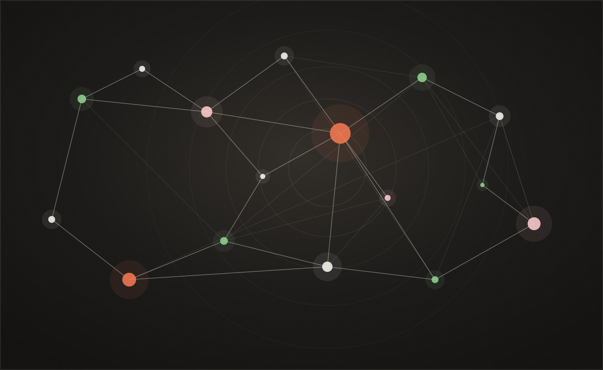

Notes on causal inference, applied econometrics, and machine learning —
written up as I work through them. Click a tag below to filter by theme.

<a class="site-pill" href="posts/msprt-vs-fixed-horizon/">Latest Notes</a>
<a class="site-pill" href="#listing-listing">All Writing</a>

