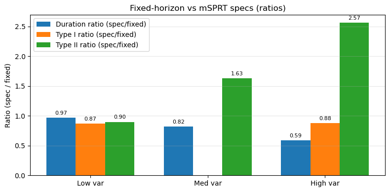
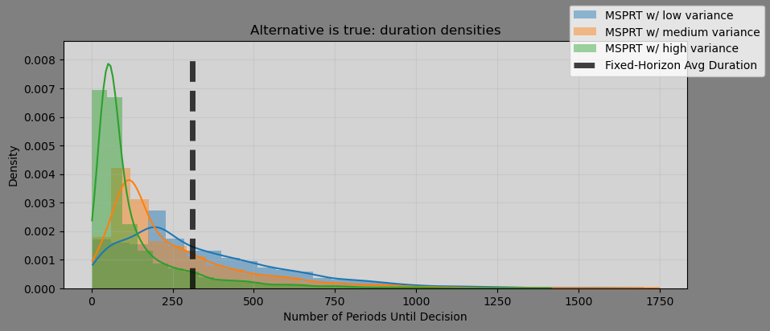

::: {.ai-disclaimer}
Written by AI following my writing style, based on the [source notebook](https://github.com/shoepaladin/causalinference_crashcourse/blob/main/OtherMaterial/SequentialTesting/1%20msprt_vs_fixed_horizon_testing.ipynb).
:::

Walking blind into an A/B test is rarely a good idea. Your experiment
benefits from your convictions about whether it will work — specifically,
what the expected impact is, and how confident you are in it.

In [a previous post](../sprt-vs-fixed-horizon/), I showed that one reason
SPRT stops earlier than a fixed-horizon test is that it tests whether the
true effect is a *single number*, rather than the more inclusive
"not-zero." **Mixture SPRT (mSPRT) covers that gap** by testing whether the
true effect comes from a specific *distribution* instead of a single point.

That sounds like it should be strictly better. It isn't a silver bullet.

## The setup

Monte Carlo with 2,000 simulations, $\alpha = 0.05$, $\beta = 0.20$, a true
effect of $\mu = 0.01$ with $\sigma = 1$, and 200 observations per period.
The comparison is between a fixed-horizon test (an oracle, designed for the
true effect size) and three mSPRT specifications that differ **only in the
variance of the prior**, all centered on the true effect:

- **Low variance** — prior variance 0.0007
- **Medium variance** — 1.5× the baseline
- **High variance** — 2.5× the baseline

Since all three priors are centered correctly, the only thing varying is
*how confident* the test is about the effect size.

## Results

| Test | Avg. duration ($H_1$) | Type II error |
|---|---|---|
| Fixed-horizon | 310.0 | 0.202 |
| mSPRT, low variance | 300.8 | 0.181 |
| mSPRT, medium variance | 253.6 | 0.329 |
| mSPRT, high variance | 182.3 | 0.517 |

The pattern is stark and monotonic. As prior variance increases, **duration
falls and false negatives rise** — from a Type II error rate of 18% at low
variance to **52% at high variance**. At that point the test is missing real
effects more often than it detects them, while finishing in roughly 59% of
the fixed-horizon time.

Type I error, meanwhile, stays controlled across all specs — around 0.044.
So this isn't a test that's silently broken; it's correctly calibrated on
the null and paying its cost entirely in power.

## Why does this happen?

The wider the prior variance, the harder it is for the test to distinguish
whether the data is more consistent with the null or the alternative. It's
genuinely difficult to tell the difference between **"the effect could be
almost anything"** and **"the effect is zero."** A diffuse prior over effect
sizes puts meaningful mass near zero, so the likelihood ratio between the
two hypotheses stays uninformative for longer — and when a boundary is
finally crossed, it's more often the wrong one.

## Takeaway

mSPRT does finish before fixed-horizon tests, and it does relax SPRT's
awkward requirement that you name a single exact effect size. But the
speed-up scales with how vague your prior is, and so does your false
negative rate. **The more uncertain you are about the treatment's effect,
the more likely you are to incorrectly conclude it does nothing.**

The practical read: mSPRT rewards well-calibrated conviction. If you have a
tight, defensible prior, you get modestly faster tests with slightly better
power than fixed-horizon. If your prior is a shrug expressed as a
distribution, a fixed-horizon test is the safer instrument.
