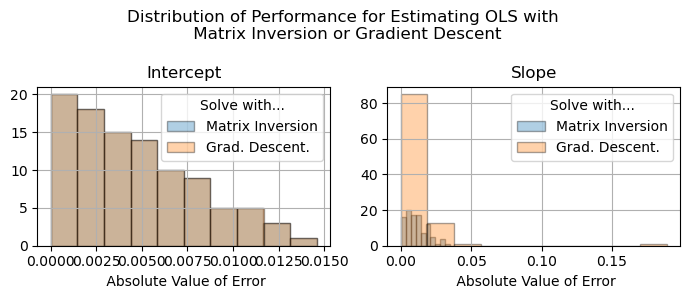

::: {.ai-disclaimer}
Written by AI following my writing style, based on the [source notebook](https://github.com/shoepaladin/causalinference_crashcourse/blob/main/OtherMaterial/OLS%20via%20Gradient%20Descent%20and%20Matrix%20Inversion.ipynb).
:::

How should we estimate ordinary least squares (OLS) models? OLS is a
versatile tool in data science because it's fast to compute and easy to
interpret, and there are two common ways to get there:

1. **Matrix inversion** — the econometrics-course approach: derive the
   analytical solution and estimate it in one calculation.
2. **Gradient descent** — the ML-course approach: use iterative optimization
   to converge on the parameters over many steps.

To make the comparison fair, the gradient descent implementation here
**doesn't get to use the analytical form of the gradient** — it estimates
the gradient numerically via finite differences, the way you'd have to if
you were optimizing a loss function you couldn't differentiate by hand.

## Setup

The finite-difference gradient of the mean squared error, evaluated by
nudging each parameter by a small $\epsilon$:

```python
def gradient_funct(f=None, x=None, e=0.0001):
    numerator = f(x + e) - f(x)
    return numerator / e

def rmse2_gradient(x=None, y=None, params=None, e=0.00000000001):
    gradient = []
    for p in range(len(params)):
        add_mod = np.zeros(len(params))
        add_mod[p] = e
        rmse2_push = np.mean((np.dot(x.T, params + add_mod) - y) ** 2)
        rmse2_base = np.mean((np.dot(x.T, params) - y) ** 2)
        gradient.append((rmse2_push - rmse2_base) / e)
    return np.array(gradient)
```

Gradient descent then repeatedly steps against this estimated gradient until
the change per step falls below a tolerance:

```python
def ols_gradient_descent(X, y, N, theta, learn_rate, num_iters, tolerance):
    x = np.concatenate((np.ones((N, 1)).T, X.T))
    theta_history = [theta]
    for i in range(num_iters):
        ols_grad = rmse2_gradient(x, y, theta_history[-1])
        change_vector = learn_rate * ols_grad
        theta_history.append(theta - change_vector)
        if np.min(np.abs(change_vector)) < tolerance:
            break
        theta = theta - change_vector
    return theta
```

Matrix inversion, by contrast, gets there in one shot via the normal
equations:

```python
def ols_matrix(X, y, N):
    x = np.concatenate((np.ones((N, 1)).T, X.T))
    var = np.linalg.inv(np.dot(x, x.T))
    cov = np.dot(y, x.T)
    return np.dot(cov, var)
```

## Simulation strategy

Data is generated from a known ground truth ($y = 0.5 + 1\cdot x + \varepsilon$),
so both estimators can be scored against the true intercept and slope. For
each of 100 simulated datasets ($N=5000$), I fit matrix inversion once and
gradient descent at four learning rates (0.01, 0.05, 0.1, 0.5), then compare
the distribution of absolute error for each method against ground truth.

## Results



The two methods perform **similarly on the intercept** — both distributions
of error hug zero. But on the **slope, matrix inversion clearly
out-performs gradient descent**: its errors cluster tighter to zero, while
gradient descent's error distribution has a longer tail even at its best
learning rate. Numerical gradient estimation compounds a small amount of
approximation error every iteration, and that error shows up disproportionately
in the slope, since the intercept's gradient direction is less sensitive to
the finite-difference step size than the slope's is.

## Takeaways

There are real gains from "doing the math." In an era of cheap compute, it's
tempting to throw computational resources at a model without understanding
how it works underneath. But working through the closed-form solution here
surfaces exactly *why* gradient descent underperforms on the slope — and
that kind of insight tends to pay for itself.

That's not an argument to throw gradient descent out, though. It's the only
option once you leave the world of models with closed-form solutions — LASSO
regression being the obvious example. Matrix inversion wins this particular
head-to-head, but it doesn't scale to every model you'll want to fit.
