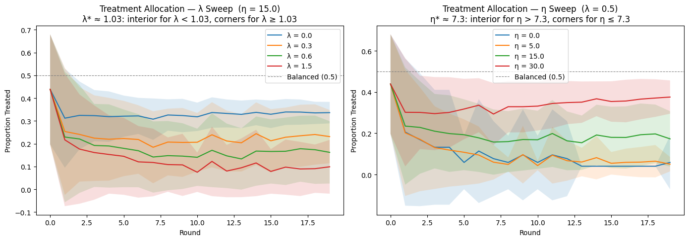
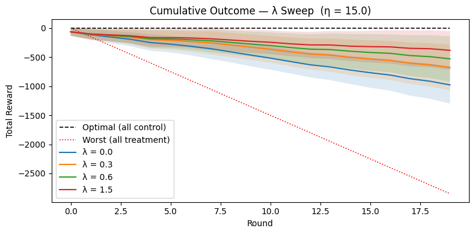

::: {.ai-disclaimer}
Written by AI following my writing style, based on the [source notebook](https://github.com/shoepaladin/causalinference_crashcourse/blob/main/OtherNotebooks/Musings/Preference_for_Experimentation.ipynb).
:::

## Problem setup

Imagine running an experiment where, each round, you decide the proportion
$p$ of users to assign to treatment. Treatment has a negative effect on the
outcome — so the optimal policy is to assign everyone to control. The catch:
the agent making this decision doesn't know that upfront. It has to learn it
from data, and every round it spends exploring costs it some reward.

Both arms share the same within-arm noise $\sigma^2$. The pooled outcome
variance is:

$$
\text{Var}(Y) = \sigma^2 + p(1-p)(\tilde{\mu}_T - \tilde{\mu}_C)^2
$$

The between-arm term peaks at $p=0.5$ and vanishes at the corners
($p \to 0$ or $p \to 1$) — which is exactly why a purely variance-averse
agent will always want to sit at a corner.

### The loss function

The agent minimizes:

$$
L(p) = -\underbrace{\bigl[p\tilde{\mu}_T + (1-p)\tilde{\mu}_C\bigr]}_{\text{expected reward}}
+ \lambda \underbrace{\bigl[\sigma^2 + p(1-p)(\tilde{\mu}_T - \tilde{\mu}_C)^2\bigr]}_{\text{outcome variance}}
- \eta \underbrace{\frac{n \cdot p(1-p)}{\sigma^2}}_{\text{Fisher info for the ATE}}
$$

Two knobs control the agent's personality:

- **$\lambda$ (variance aversion)** — penalizes outcome variance. High
  $\lambda$ pushes the agent toward corners, to kill the between-arm term.
- **$\eta$ (experimentation incentive)** — rewards Fisher information about
  the treatment effect. High $\eta$ pulls the agent back toward a balanced
  split, because that's where the ATE is estimated most precisely.

### Interior vs. corner optimum

The curvature of $L$ in $p$ tells you which force wins:

$$
\frac{d^2 L}{dp^2} = -2\lambda(\tilde{\mu}_T - \tilde{\mu}_C)^2 + \frac{2\eta n}{\sigma^2}
$$

| Condition | Curvature | Optimal $p$ |
|---|---|---|
| $\lambda > \lambda^* = \eta n / (\sigma^2 \cdot \text{gap}^2)$ | Negative (concave) | Corner (0 or 1) |
| $\lambda < \lambda^*$ | Positive (convex) | Interior ($\approx 0.5$) |

With $n=50$, $\sigma=9$, true gap $=3$: $\lambda^* = \eta / 14.58$.

## Thompson sampling for arm means

### Why point estimates aren't enough

Each round, the agent only observes a noisy sample mean $\bar{x}_{arm}$ per
arm. When an arm has been visited infrequently — say 3 users per round go to
treatment — that sample mean can be far from the truth:

$$
\text{Var}(\bar{x}) = \frac{\sigma^2}{n} \qquad \Rightarrow \qquad \text{SE}(\bar{x}) = \frac{\sigma}{\sqrt{n}}
$$

With $\sigma=9$ and $n=15$ (5 rounds at $p=0.05$): $\text{SE}(\bar{T}) \approx 2.3$.
That's too noisy for the agent to be confident which arm is actually better.
Plugging point estimates $(\bar{T}, \bar{C})$ straight into the loss treats
the agent as if it *knows* the arm means exactly — which causes it to
commit to a corner before it has enough evidence.

### The Bayesian posterior

Assume outcomes are normal with **known** within-arm noise $\sigma^2$:
$Y_i^{(arm)} \sim \mathcal{N}(\mu_{arm}, \sigma^2)$. Under a flat prior, after
observing $n$ outcomes with sample mean $\bar{x}$:

$$
\mu_{arm} \mid \text{data} \sim \mathcal{N}\!\left(\bar{x}, \frac{\sigma^2}{n}\right)
$$

The posterior mean equals the sample mean, and the posterior spread shrinks
toward zero as $n$ grows — the agent's belief tightens with more data.

### The decision rule

Instead of plugging $\bar T$ and $\bar C$ directly into the loss, the agent
**samples** from the posteriors each round:

$$
\tilde{\mu}_T \sim \mathcal{N}\!\left(\bar{T}, \frac{\sigma_T^2}{n_T}\right), \qquad
\tilde{\mu}_C \sim \mathcal{N}\!\left(\bar{C}, \frac{\sigma_C^2}{n_C}\right)
$$

and evaluates the loss using $(\tilde\mu_T, \tilde\mu_C)$ in place of the raw
sample means. Early on, posteriors are wide, so draws can flip the sign of
$\tilde\mu_T - \tilde\mu_C$ — genuine exploration. As $n$ grows, draws
cluster near the true means and the agent exploits. The feedback loop is
what makes this interesting: the allocation chosen this round determines how
fast next round's posteriors tighten, so a high-$\lambda$ agent that commits
early to treatment stays confidently wrong for longer, since it never
collects enough control observations to correct itself.

## Simulation results

I swept $\lambda$ (holding $\eta=15$) and $\eta$ (holding $\lambda=0.5$) over
20 rounds, 50 simulation runs each:

The left panel confirms the theory: past the $\lambda^* \approx 1.03$
threshold, agents collapse toward a corner. The right panel shows the mirror
image — past $\eta^* \approx 7.3$, agents hold a meaningfully balanced split
even though treatment is actively hurting their reward in the short run.

That balance isn't free. Here's the cumulative reward cost of experimenting,
for the $\lambda$ sweep:

Every curve sits between the two bounds — the price of experimentation is
real, but bounded, and it buys the information needed to eventually converge
on the right policy.

## FAQ: why doesn't a pure variance penalty work?

Set $\eta = 0$. With Thompson-sampled means, the loss is:

$$
L(p) = -\bigl[p\tilde\mu_T + (1-p)\tilde\mu_C\bigr] + \lambda\Bigl[\sigma^2 + p(1-p)(\tilde\mu_T-\tilde\mu_C)^2\Bigr]
$$

**The loss is concave, so corners always win.**
$\frac{d^2 L}{dp^2} = -2\lambda(\tilde\mu_T-\tilde\mu_C)^2 \le 0$ everywhere —
intermediate splits are never optimal, regardless of $\lambda$.

**$\lambda$ literally cancels out at the corners.** The between-arm term
$p(1-p)$ takes the same value at both extreme grid points ($0.05\times 0.95 =
0.95 \times 0.05 = 0.0475$), so:

$$
L(0.95) - L(0.05) = 0.9(\tilde\mu_C - \tilde\mu_T)
$$

Every $\lambda$ term drops out. The agent always picks whichever corner
matches its current Thompson draw — $\lambda$ changes the *magnitude* of the
loss, never the *allocation*.

**Why the Fisher-information bonus fixes this.** Adding
$-\eta \cdot p(1-p) \cdot n/\sigma^2$ changes the curvature to
$-2\lambda(\tilde\mu_T-\tilde\mu_C)^2 + 2\eta n/\sigma^2$. When
$\eta n/\sigma^2 > \lambda(\tilde\mu_T-\tilde\mu_C)^2$, the loss turns convex
and an interior $p^*$ becomes optimal. Unlike the variance term, the
information bonus doesn't cancel at the corners relative to the center — so
it's the one lever that can make deliberate experimentation rational, and
the ratio $\lambda/\eta$ is what governs the exploit-vs-explore tradeoff.
