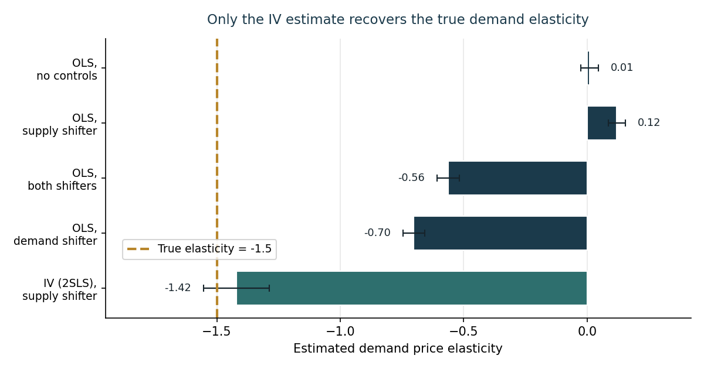

::: {.ai-disclaimer}
Written by AI following my writing style, based on the [source notebook](https://github.com/shoepaladin/causalinference_crashcourse/blob/main/OtherMaterial/Price%20Demand%20Elasticity%20Example.ipynb).
:::

The objective here is to demonstrate that **understanding the identifying
variation behind an estimate is crucial for interpretation**. The vehicle is
a classical economics problem: estimating supply and demand price
elasticity.

The setup is a simulation, which means we know the right answer up front —
the true demand price elasticity is **-1.5** and the true supply elasticity
is **0.5**. That lets us score every estimation strategy against ground
truth, rather than arguing about which one *looks* more reasonable.

## The simulation

I simulate a supply and demand system driven by supply and demand cost
shifters, plus unobserved variation in both. A non-linear solver finds the
equilibrium price and quantity for each observation, and the unobserved
shocks are allowed to correlate with the shifters — which is exactly the
situation that makes naive estimation fail.

Then comes the important restriction: **suppose we only observe the
equilibrium prices, quantities, and shifters.** That's the realistic data
situation. What would a naive analyst estimate?

## Reduced-form OLS: all wrong

Four OLS specifications, adding controls in the way an analyst normally
would:

| Specification | Estimate [SE] |
|---|---|
| No controls | 0.010 [0.036] |
| + supply shifter | 0.120 [0.035] |
| + both shifters | -0.562 [0.045] |
| + demand shifter | -0.702 [0.044] |
| **True value** | **-1.500** |

Every one of them misses, and the first two don't even get the *sign* right
— they imply demand slopes upward. Adding more controls moves the estimate
in the right direction, but "closer to the truth" isn't the same as
"unbiased," and without knowing the answer you'd have no way to tell how far
you still were.

## Machine learning doesn't fix it either

The natural next move is to reach for more flexible models. I ran a random
forest regressor with cross-validated hyperparameters (5-fold CV over tree
depth, minimum leaf size, and number of estimators), plus some rough feature
engineering — indicators for whether the shifters exceed a threshold, and
interactions between them.

It doesn't help. The problem isn't functional form, and a more flexible
conditional expectation of price given quantity doesn't change that. The
observed equilibrium points are generated by *both* curves moving at once,
so no model that just predicts price from quantity — however flexible — can
separate movement along the demand curve from movement of the demand curve
itself.

## Instrumental variables: the identifying variation

The fix is to find variation that moves *only one* curve. Instrumenting
quantity with the **supply shifter** does exactly this: random variation in
supply shifts the supply curve, which traces out points along a fixed demand
curve. That's the "experimental" variation we need — and it recovers **-1.420
[0.133]**, within sampling error of the true -1.5.

## Takeaway

The lesson isn't "IV good, OLS bad." It's that **the estimator matters less
than knowing which variation identifies your parameter.** OLS with controls
and a tuned random forest are both perfectly competent tools that produce
confidently wrong answers here, because neither addresses the simultaneity
that generated the data. When the data-generating process has structure —
and economic data usually does — a method that imposes that structure will
beat a method that ignores it, no matter how flexible the second one is.
