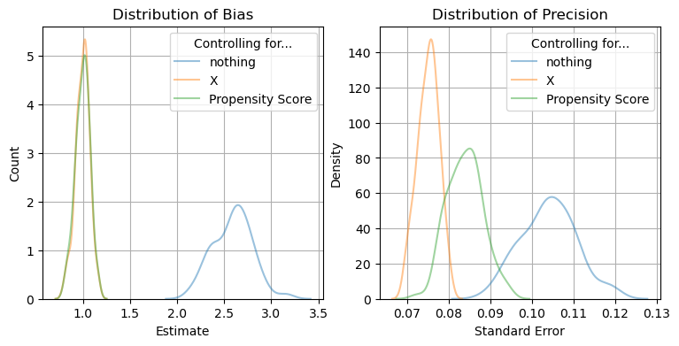

::: {.ai-disclaimer}
Written by AI following my writing style, based on the [source notebook](https://github.com/shoepaladin/causalinference_crashcourse/blob/main/OtherMaterial/Causal%20ML%20DML%20and%20Otherwise/All%20You%20Need%20Are%20Propensity%20Scores.ipynb).
:::

Propensity scores are all you need — sometimes. Using simulated data, this
post checks a classical result: **controlling for the propensity score alone
gets you the same unbiased treatment effect estimate as controlling for
every confounder directly.** That's exactly what Rosenbaum & Rubin (1983)
proved theoretically. There's still a catch, though — precision.

## The simulation

Each dataset has $k$ confounders $X$, a binary treatment $w$ whose
assignment probability depends on $X$ through a logistic model, and an
outcome $y$ with a true treatment effect of exactly 1.0:

```python
def simulate_data(n_samples, n_confounders):
    X = np.random.normal(0, 1, (n_samples, n_confounders))

    propensity_coef = np.random.uniform(0.5, 1, n_confounders)
    propensity_latent = np.dot(propensity_coef.reshape(1, n_confounders), X.T)
    treatment_prob = 1 / (1 + np.exp(propensity_latent))
    treatment = np.random.binomial(1, treatment_prob).reshape(n_samples, 1)

    true_effect = 1.0
    baseline_y = (np.random.uniform(0, 1)
                  + np.dot(np.random.uniform(-1, -0.5, n_confounders).reshape(1, n_confounders), X.T)
                  + np.random.normal(0, 1, n_samples))
    outcome = baseline_y.T + true_effect * treatment
    return pd.DataFrame({**{f'X_{i}': X[:, i] for i in range(n_confounders)},
                          'w': treatment.flatten(), 'y': outcome.flatten()})
```

Four estimators are compared, all just OLS with a different set of controls:

- **naive** — regress $y$ on $w$ alone (no controls at all).
- **X** — regress on $w$ plus every confounder $X$ directly.
- **propensity score** — estimate $\hat{e}(X) = P(w=1\mid X)$ with logistic
  regression, then regress $y$ on $w$ plus that single scalar $\hat e(X)$.
- **X + propensity score** — both, for comparison.

Over 100 simulated datasets ($n=1000$, 4 confounders), each estimator's
coefficient on $w$ and its standard error are recorded.

## Results



The **naive** estimator is badly biased — its distribution sits well above
the true effect of 1.0, since it never accounts for confounding. Both
**controlling for X directly** and **controlling for the propensity score
alone** center tightly on the true effect of 1.0. That's Rosenbaum & Rubin's
result showing up empirically: the propensity score is a *balancing score*,
so conditioning on it alone is enough to remove confounding bias, even
though it throws away the individual $X$ variables.

The right panel is where the two unbiased estimators diverge: **controlling
for X directly gives tighter standard errors than controlling for the
propensity score alone.** Collapsing $k$ confounders into a single scalar
$\hat e(X)$ removes bias, but it also throws away information that would
otherwise sharpen precision — you get unbiasedness essentially for free, but
efficiency is not automatic.

## Takeaway

If all you have is a well-estimated propensity score, you can still recover
an unbiased average treatment effect. But if you have the underlying
confounders too, controlling for them directly — or combining both — buys
you real precision gains on top of that unbiasedness. Propensity scores are
all you need for **identification**; they're not the last word on
**efficiency**.
