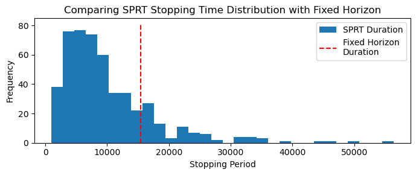

::: {.ai-disclaimer}
Written by AI following my writing style, based on the [source notebook](https://github.com/shoepaladin/causalinference_crashcourse/blob/main/OtherMaterial/SequentialTesting/0%20sprt_vs_fixed_horizon_testing.ipynb).
:::

**Sound byte**: Everyone knows sequential testing lets you stop your experiment
earlier. The usual reason given is that you get to peek at the data without
p-hacking yourself. That is true, but it buries the bigger reason.

This post simulates a Sequential Probability Ratio Test (SPRT) against the
fixed-horizon z-test you already run, holding the data and the error targets
fixed. I show that SPRT's speed advantage comes largely from **testing a
different alternative hypothesis** — and that the speed you gain shows up as
unpredictability you have to manage.

## The two tests are not asking the same question

Your fixed-horizon test asks whether the difference is anything at all —
$H_1: \mu \neq 0$. SPRT asks whether the difference is *one specific number* —
$H_1: \mu = \delta$.

That is a much stronger commitment, and it is where the speed comes from. SPRT
puts all its eggs in one basket. If the true effect really is that number, you
get to go home early. You are not being cleverer than the fixed-horizon test;
you are answering an easier question because you brought more to the table
before you started.

## How the comparison works

Both tests get the same data-generating process, the same number of users
arriving each period, and the same targets for Type I and Type II error, across
many simulated experiments.

The fixed-horizon test is the one you already run: pick your sample size up
front from a power calculation, wait, then look once.

$$
n = \left(\frac{(z_\alpha + z_\beta)\,\sigma}{\delta}\right)^2
$$

SPRT is Wald's sequential probability ratio test for normal means with known
variance. Every period, you update the likelihood ratio comparing your two
hypotheses and check it against two boundaries. Cross the top and you stop and
declare an effect. Cross the bottom and you stop and declare nothing. Otherwise
you keep collecting.

## What the simulations show

**Your error rates do not get worse.** Both tests land on the Type I and Type
II error you asked for. This is the part worth internalizing: you are not
trading accuracy for speed.

What you are buying is time. SPRT finishes in roughly **half** the
fixed-horizon duration when there is no effect to find, and around
**two-thirds** of it when there is one. Those are real savings on a real
roadmap.

Now look at that histogram before you get too excited. Most runs finish well
left of the red line — but the right tail is long, and some runs go well past
the fixed horizon before deciding anything.

To be clear, that tail is the part that will actually bite you. Your
fixed-horizon test gives you a date you can put on a roadmap. SPRT gives you a
*distribution* of dates. The average is much better and the worst case is
worse, and the person asking when your readout lands does not care about your
average.

## What this means for your next test

The speed-up is not free, and it is not really about peeking. You pay for it by
committing to a sharper alternative hypothesis before you start.

So ask yourself whether you actually have that conviction. If you can say "I
think this ships a 2% lift" and defend it, SPRT converts that belief into a
shorter experiment. If you are honestly asking "does this do anything at all?",
you are not running the test SPRT was built for, and you should not expect to
be rewarded for it.

Of course, most of us are somewhere in between — you have a number in mind but
you would not bet your quarter on it. So what happens when you have a belief
about the effect size but real uncertainty around it? That is what mixture SPRT
is for, and I run those simulations
[in the next post](../msprt-vs-fixed-horizon/).
