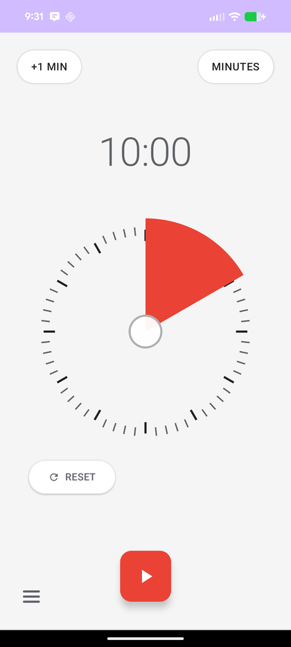

### statanomics
<a class="site-pill" href="https://github.com/shoepaladin/statanomics" target="_blank" rel="noopener">
<i class="bi bi-github"></i> View on GitHub
</a>

A unified Python library for causal inference, where every estimator shares one
API so swapping models is a single function-call change. It also ships
diagnostics for checking the unconfoundedness and overlap assumptions causal
inference depends on, even when there is no ground truth to validate against.

**Worth digging into:**
<ul class="project-highlights">
<li><strong>stnomics</strong> — the core package: ATE/ATET estimators (OLS, propensity binning, regression adjustment, double machine learning, doubly robust), heterogeneous treatment effect models, prediction QC, and bootstrap inference, all behind a shared syntax.</li>
<li><strong>panelib</strong> — the panel-data companion: hand-written synthetic control, difference-in-differences and synthetic DiD, event-study placebo testing, and conformal inference for panel settings.</li>
</ul>

### causalinference_crashcourse
<a class="site-pill" href="https://github.com/shoepaladin/causalinference_crashcourse" target="_blank" rel="noopener">
<i class="bi bi-github"></i> View on GitHub
</a>

A from-scratch causal inference curriculum for scientists, built as a
sequence of slide decks paired with companion Jupyter notebooks. It runs
from potential-outcomes foundations through ATE/ATET estimators, inference,
best practices, heterogeneous treatment effects, panel data, and regression
discontinuity design.

**Worth digging into:**
<ul class="project-highlights">
<li><strong>Regression Discontinuity module</strong> — hand-codes local-linear estimation and pairs it with <code>rdrobust</code>/<code>rddensity</code>, plus a full validation battery (manipulation/density tests, covariate continuity, placebo cutoffs, bandwidth sensitivity).</li>
<li><strong>Arguable Validation module</strong> — placebo testing and Oster (2013) coefficient-stability bounds for judging identification assumptions you can't directly test.</li>
</ul>

### Seattle Area School Dashboard
<a class="site-pill" href="https://shoepaladin.github.io/data-flora/" target="_blank" rel="noopener">
<i class="bi bi-box-arrow-up-right"></i> View the Dashboard
</a>

A static dashboard tracking school performance trends across eleven Puget
Sound districts — Bainbridge Island, Bellevue, Central Kitsap, Issaquah, Lake
Washington, Mercer Island, North Kitsap, Renton, Seattle, Snoqualmie Valley,
and Vashon Island — covering the 2015-16 through 2024-25 school years. It
pulls enrollment and demographics from the NCES Common Core of Data and
assessment, growth, and graduation outcomes from Washington's OSPI, the same
underlying data that powers GreatSchools.org, then joins it into one static
site with a PCA-based composite ranking across schools. Source and build
pipeline are in
[data-flora](https://github.com/shoepaladin/data-flora) on GitHub.

### kiwi-cup
<a class="site-pill" href="https://github.com/shoepaladin/kiwi-cup" target="_blank" rel="noopener">
<i class="bi bi-github"></i> View on GitHub
</a>

A personal collection of fun side projects, built well outside the day job.
It holds two vibe-coded Android apps plus a set of Pebble watchfaces.

**Worth digging into:**
<ul class="project-highlights">
<li><strong>clocktimer</strong> — a stopwatch and timer with no tabs at all: you tap the clock itself to switch between the two modes.</li>
<li><strong>wallpaper-rotator</strong> — build a deck of pictures and let your wallpaper rotate through them.</li>
</ul>

clocktimer
<a class="site-pill" href="https://github.com/shoepaladin/kiwi-cup/tree/main/clocktimer" target="_blank" rel="noopener">Repo &amp; APK</a>

wallpaper-rotator
<a class="site-pill" href="https://github.com/shoepaladin/kiwi-cup/tree/main/wallpaper-rotator" target="_blank" rel="noopener">Repo &amp; APK</a>

